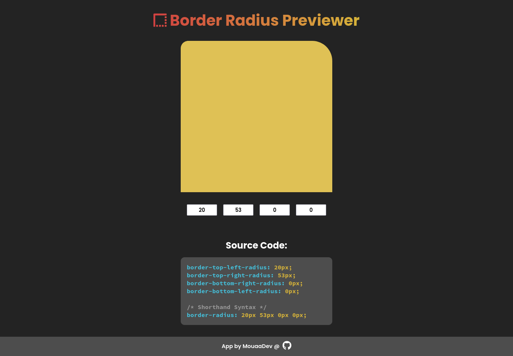

# Border Radius Prviewer

The app allow you to enter four values and preview its effect in realtime. The source code under the inputs changes with inputs values.

I used Vue JS 3 to build this project as a practice. So feel free to use my code.
If you have any advice to improve the code, contact me on my accounts below.

## Contacts

**[GitHub](https://github.com/MouaaDev)**

**[Telegram](https://t.me/mouaadhamza)**

**[Facebook](https://www.facebook.com/mouaadev/)**

**[Twitter](https://twitter.com/mouaadev)**
